# AGENT PIPELINE
There will be 3 main tasks:
- Custom Chatbot Generator Task
- AI Enrollment & Admissions Agent Task
- Recruitment AI Matcher

## Custom Chatbot Generator
### Overview Proposed Workflow
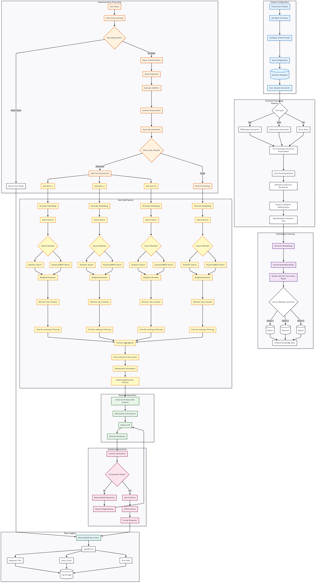

### Detailed Pipeline
#### 1. Chatbot Configuration

**Steps:**
1. **Create Chatbot** → Generate unique ID
2. **Set Name & Purpose** → Define chatbot identity
3. **Configure Initial Prompt** → Set personality and constraints
4. **Save Configuration** → Store in database with dedicated vector namespace

**Initial Prompt Example:**
```
You are a professional assistant. Answer only from provided documents.
Always cite sources. Be concise and accurate.
```

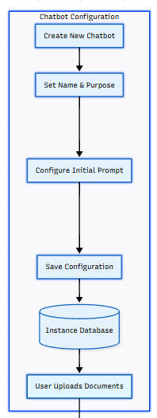

#### 2. Document Processing

**2.1 Upload & Extraction**
- **Supported**: PDF (PDFPlumber), DOCX (python-docx), TXT
- **Extracts**: Text, tables, structure, metadata

**2.2 Text Processing**
- Clean text (remove special characters, fix encoding)
- Preserve document structure (headings, lists, tables)

**2.3 Late-Chunking + semantic chunking**
- **Chunk size**: 8192 tokens (Using jinai)

**2.4 Metadata**
Each chunk includes:
- Source document
- Page number
- Section info
- Position

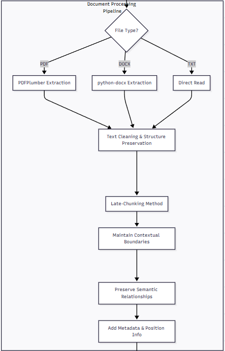

#### 3. Embedding & Storage

**3.1 Custom Embedding Model**
- Custome embedding model (greennode)
- Output: 1024 dimension vectors

**3.2 Vector Database**
**Options**: Milvus, Pinecone, or Qdrant
- Store embeddings with metadata
- Separate namespace per chatbot

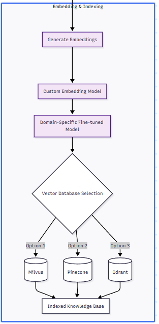

#### 4. Query Processing
**4.1 Input Processing**
1. Receive user query
2. Preprocess 
3. Check auto-reply rules → Return if matched

**4.2 Query Enhancement**
- **Expansion**: Add synonyms and related terms
- **Decomposition**: Split multi-part queries
  ```
  "What's the price and delivery time?" 
  → ["What's the price?", "What's the delivery time?"]
  ```

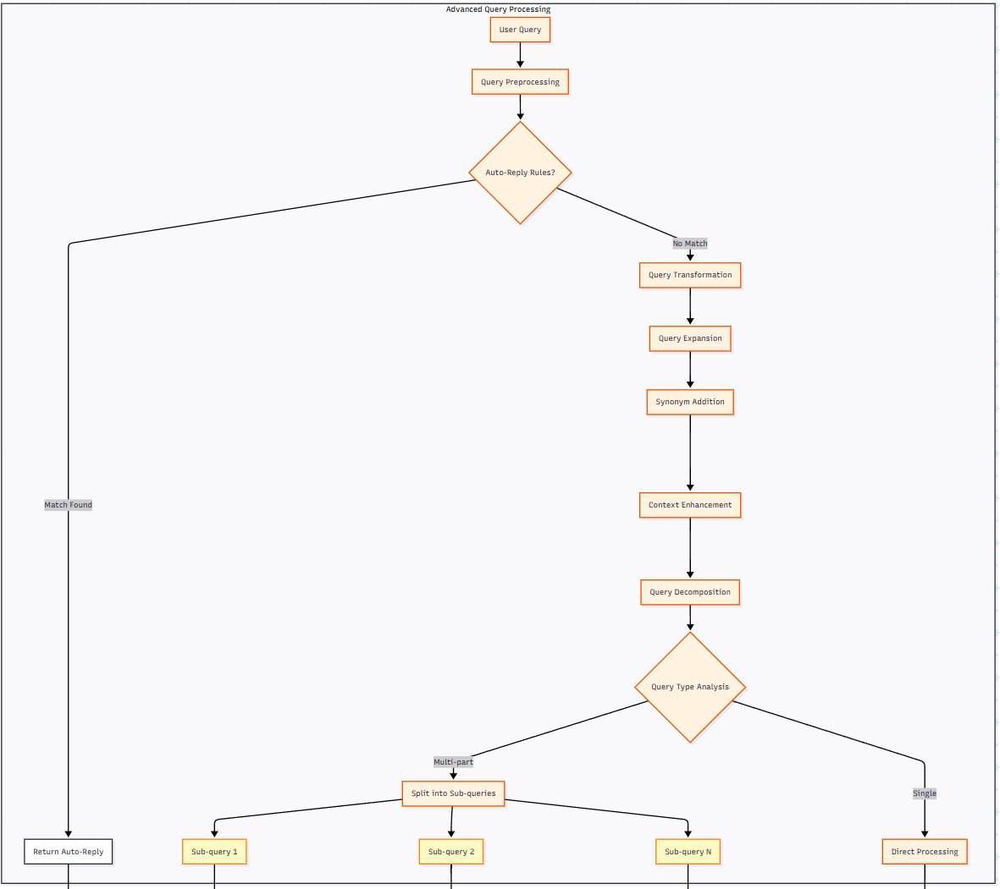

#### 5. Multi-RAG Retrieval

**5.1 Hybrid Search (Per Sub-query)**

**Hybrid searches**:
1. **Semantic Search**: Vector similarity
2. **Keyword Search**: BM25 algorithm

**5.2 Weighted Reranking**
```
final_score = (0.6 × semantic_score) + (0.4 × keyword_score)
```

**5.3 Retrieval**
- Get top 5-10 chunks per sub-query
- Final re-ranking and filtering
- Remove duplicates

**5.4 Context Building**
- Aggregate results from all sub-queries
- Deduplicate information
- Order logically

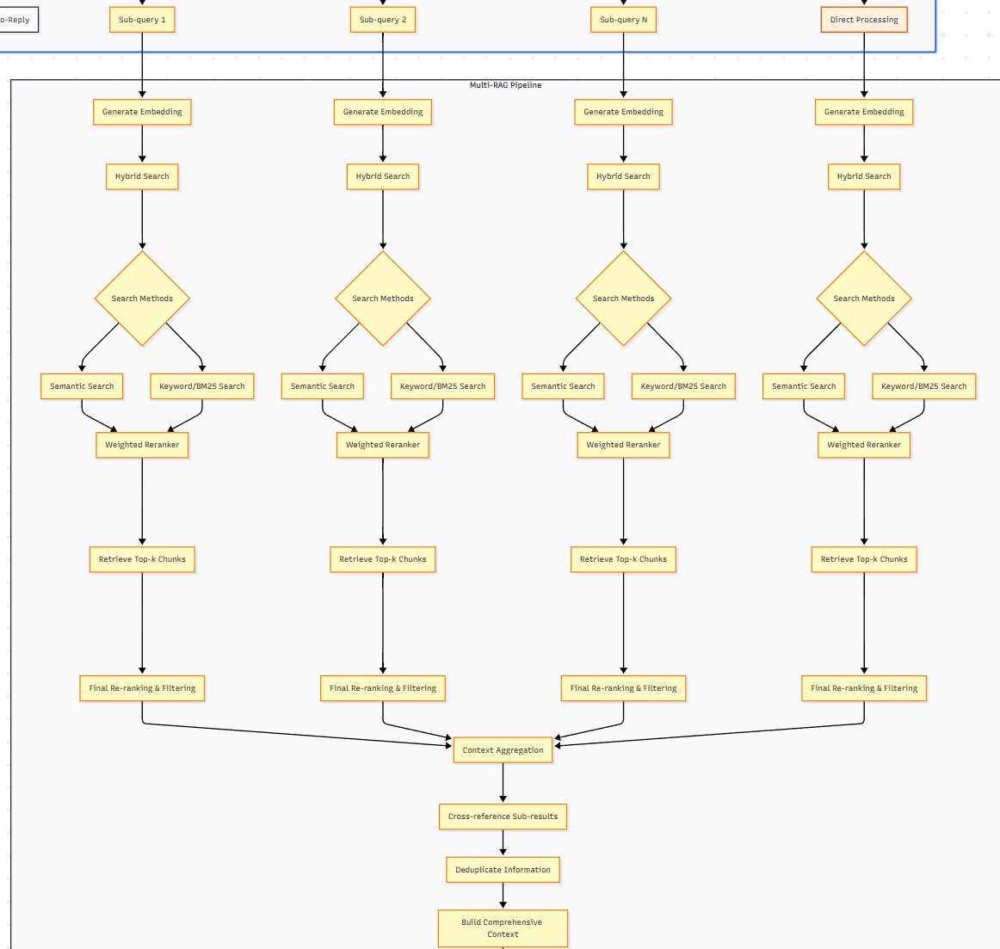

#### 6. Response Generation

**6.1 Prompt Construction**
```
System: [Chatbot configuration]
Context: [Retrieved chunks with sources]
Query: [User question]
Instructions: Answer only from context, cite sources
```

**6.2 Gemini LLM**
- Temperature: 0.3-0.5
- Generate response with citations

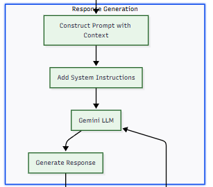

#### 7. Validation

**7.1 Checks**
1. **Content Verification**: Ensure claims match sources
2. **Scope Check**: Remove any out-of-document content
3. **Add Citations**: Format: `[Source: document.pdf, page X]`
4. **Safety Checks**: Filter inappropriate content

#### 7.2 Regeneration
If validation fails → Modify and regenerate

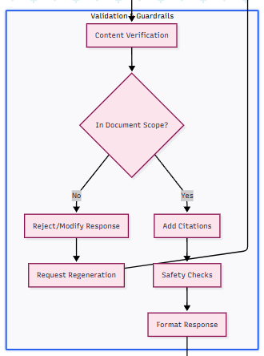

#### 8. Output

**8.1 Response Delivery**
- Formatted answer with citations
- Return to user via original channel

**8.2 Logging**
- Response time
- Query count  
- Error rate

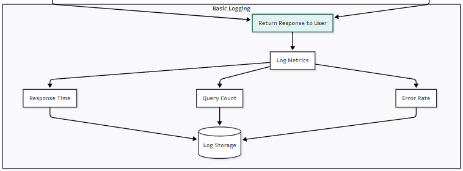

### Pipeline Flow Summary

```
User Query → Auto-Reply Check → Query Processing → Multi-RAG Search 
→ Context Building → Gemini Generation → Validation → Response
```

## AI Enrollment & Admissions Agent
### Overview Proposed Workflow
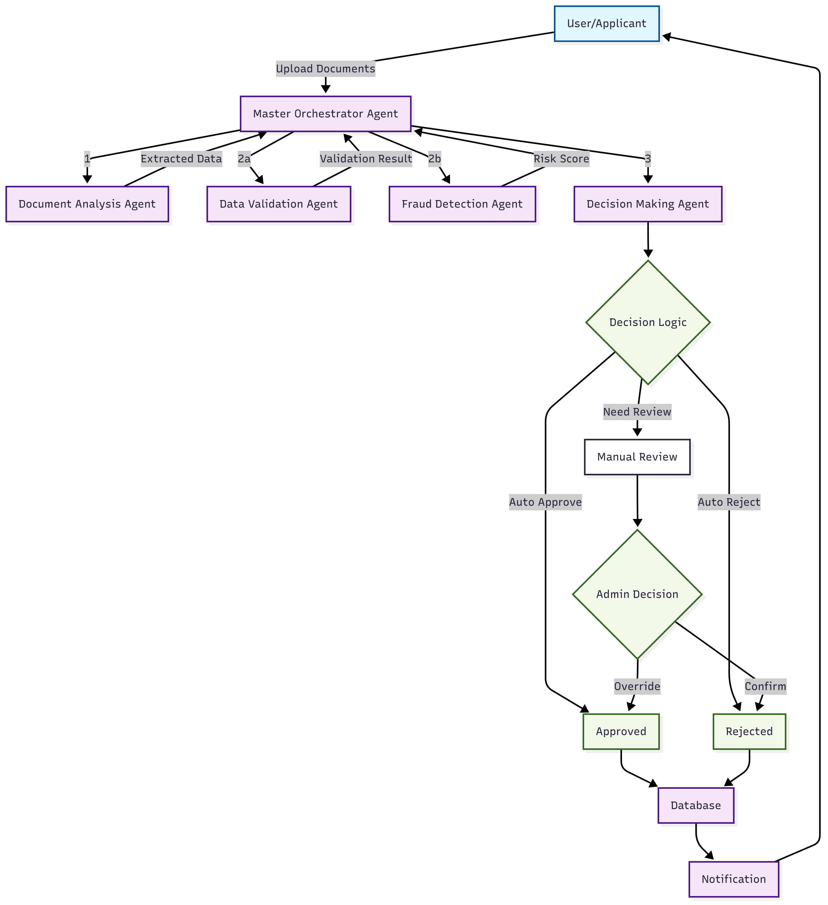

### Detailed Pipeline
#### 1. **User/Applicant → Orchestrator**

**What happens:** A user takes photos of their 3 documents using their phone or webcam
- 📱 National ID card photo
- 📜 Degree/Certificate photo  
- 📄 Birth certificate photo

The **Master Orchestrator Agent** receives these images and manages the entire process.

#### 2. **Orchestrator → Document Analysis Agent (Step 1)**

**What happens:** The Document Analysis Agent (using Gemini Vision API) scans all 3 documents

**Extracts:**
- Full name from each document
- Date of birth
- ID number
- School name (from certificate)
- Issue dates
- Any other text fields

**Example output:**
```
National ID: 
- Name: "John Smith"
- ID: "123456789"
- DOB: "1998-05-15"

Degree Certificate:
- Name: "John Smith"
- School: "State University"
- Graduation: "2022-06-20"

Birth Certificate:
- Name: "John Smith"
- DOB: "1998-05-15"
- Parents: "Mary & Robert Smith"
```

#### 3. **Parallel Processing (Steps 2a & 2b)**

**2a - Validation Agent checks:**
- ✅ Are all required fields present? (name, DOB, ID number)
- ✅ Do names match? ("John Smith" on all 3 documents?)
- ✅ Is the person 18+ years old?
- ✅ Is graduation date after birth date?
- ✅ Are ID numbers in correct format?

**2b - Fraud Detection Agent analyzes (simultaneously):**
- 🔍 Looking for visual tampering (edited photos, misaligned text)
- 🔍 Checking font consistency (all text same style?)
- 🔍 Detecting photoshop/digital manipulation
- 🔍 Comparing document templates to known legitimate ones
- 🔍 Checking if documents look authentic

Both agents work **at the same time** to save processing time.

#### 4. **Results → Decision Making Agent (Step 3)**
The Decision Agent receives:
- Validation Result: "PASSED" or "FAILED" or "WARNING"
- Risk Score: "LOW" or "MEDIUM" or "HIGH"

**Decision Logic:**
- ✅ Validation PASSED + Risk LOW = **Auto Approve**
- ❌ Validation FAILED = **Auto Reject** 
-⚠️ Risk HIGH = **Auto Reject**
- 🤔 Validation WARNING or Risk MEDIUM = **Manual Review**


#### 5. **Three Possible Paths:**

**A. Auto Approve** - Everything looks perfect
- Student is eligible
- Documents are authentic
- Goes straight to database

**B. Auto Reject** - Clear problems found
- Missing required info
- Age under 18
- Obvious fake document
- Goes to database with rejection reason

**C. Manual Review** - Something suspicious but not conclusive
- Admin sees original photos
- Admin sees what the AI found suspicious
- Admin can override and approve OR confirm rejection
- All admin actions are logged

#### 6. **Database Storage**
Saves everything:
- Student profile (structured data)
- Original document images
- Validation results
- Fraud detection findings
- Final decision
- Complete audit trail (who did what, when)

#### 7. **Notification**
- ✅ "Congratulations! Your enrollment is approved"
- ❌ "Sorry, your application was rejected because: [reason]"
- 🕐 "Your application is under review"

### Pipeline Flow Summary
**User uploads documents:**

1. **Orchestrator** receives 3 photos
2. **Document Analysis** extracts:
   - Name: "Sarah Johnson" (all docs)
   - DOB: "2003-03-15" 
   - ID: "987654321"
   - School: "City High School"
   - Graduation: "2022-05-30"

3. **Parallel Processing:**
   - **Validation**: ✅ All fields present, ✅ Names match, ✅ Age 21, ✅ Dates logical
   - **Fraud Detection**: ⚠️ Medium risk - font on ID looks slightly different

4. **Decision**: Manual Review needed (medium risk)

5. **Admin Review**: 
   - Admin checks: "It's just an old ID card with worn text"
   - Admin approves with override

6. **Database**: Stores everything including admin's override reason

7. **Notification**: Sarah gets "Enrollment Approved!" email## AI Enrollment & Admissions Agent


## Recruitment AI Matcher
### Overview Proposed Workflow
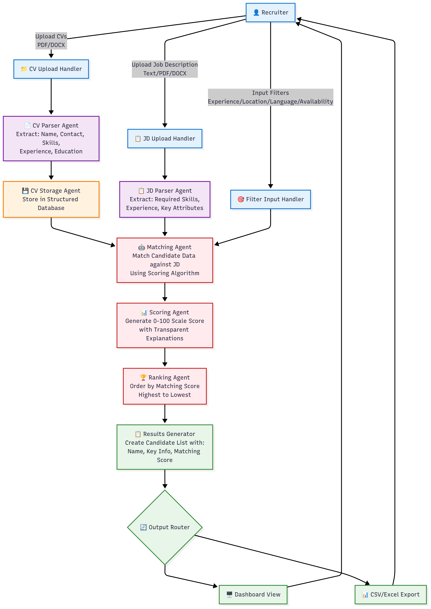

### Detailed Pipeline
#### 1. **Recruiter → Upload Handler Agents**

**What happens:** A recruiter uploads documents and sets filtering criteria through the system interface
- 📄 CV files (PDF/DOCX format)
- 📋 Job Description (Text/PDF/DOCX format)  
- 🎯 Filter criteria (experience, location, language, availability)

The **CV Upload Handler** and **JD Upload Handler** receive these files and manage the intake process.

#### 2. **Upload Handlers → Parser Agents (Step 1)**

**What happens:** The CV Parser Agent and JD Parser Agent (using Gemini) process the uploaded documents

**CV Parser Agent extracts:**
- Full name and contact information
- Skills and technical competencies
- Work experience and duration
- Education background
- Languages spoken
- Location and availability

**JD Parser Agent extracts:**
- Required skills and competencies
- Experience level needed
- Education requirements
- Location preferences
- Language requirements
- Key job attributes

**Example CV extraction:**
```
CV Data:
- Name: "Sarah Johnson"
- Email: "sarah.j@email.com"
- Skills: ["Python", "Machine Learning", "SQL", "AWS"]
- Experience: "3 years Software Engineering"
- Education: "BS Computer Science, State University"
- Location: "New York, NY"
- Languages: ["English", "Spanish"]
```

**Example JD extraction:**
```
Job Requirements:
- Title: "Senior Python Developer"
- Required Skills: ["Python", "Django", "PostgreSQL", "AWS"]
- Experience: "3+ years backend development"
- Education: "Bachelor's degree in Computer Science"
- Location: "New York, NY (Remote OK)"
- Languages: ["English"]
```

#### 3. **Data Storage & Matching Process (Steps 2a & 2b)**

**2a - CV Storage Agent:**
- ✅ Stores parsed candidate data in structured database
- ✅ Validates data completeness and format
- ✅ Creates searchable candidate profiles
- ✅ Maintains data integrity and relationships

**2b - Matching Agent analyzes (simultaneously):**
- 🔍 Compares candidate skills against job requirements
- 🔍 Evaluates experience level alignment
- 🔍 Checks location compatibility
- 🔍 Assesses education match
- 🔍 Reviews language requirements
- 🔍 Applies recruiter-defined filters

Both agents work **at the same time** to optimize processing efficiency.

#### 4. **Matching Results → Scoring Agent (Step 3)**
The Scoring Agent receives:
- Skill Match Score: 0-100 scale
- Experience Match Score: 0-100 scale  
- Location Match Score: 0-100 scale
- Education Match Score: 0-100 scale
- Filter Compliance: "PASSED" or "FAILED"

**Scoring Logic:**
- 🎯 **Skills Match (40% weight)**: Exact matches get higher scores
- 📊 **Experience Match (30% weight)**: Years and relevance factor
- 🌍 **Location Match (15% weight)**: Geographic preferences
- 🎓 **Education Match (15% weight)**: Degree and institution relevance
-⚠️ **Filter Compliance**: Must pass all mandatory filters

**Transparency Features:**
- Each score component is explained
- Matching criteria are clearly identified
- Reasoning for scores is provided

#### 5. **Three Possible Scoring Outcomes:**

**A. High Match (80-100 score)** - Excellent candidate fit
- Strong skills alignment
- Experience level matches perfectly
- Location and education requirements met
- Goes to top of ranked list

**B. Medium Match (50-79 score)** - Good candidate with some gaps
- Partial skills match
- Experience close but not perfect
- Some requirements met
- Placed in middle of ranked list

**C. Low Match (0-49 score)** - Poor candidate fit
- Minimal skills overlap
- Experience doesn't align
- Missing key requirements
- Placed at bottom of ranked list

### 6. **Results Generation & Output**
**Results Generator creates:**
- Candidate profile summary
- Matching score (0-100)
- Detailed explanation of scoring
- Key strengths and gaps
- Ranking position

**Output Router provides:**
- 🖥️ **Dashboard View**: Interactive candidate list with filters
- 📊 **Excel Export**: Downloadable CSV/Excel file with all data
- 📋 **Detailed Reports**: Comprehensive matching analysis

### 7. **Delivery to Recruiter**
- ✅ "Found 25 matching candidates - top match: 94% score"
- 📊 "Export complete - Excel file ready for download"
- 🔍 "View detailed explanations for each candidate match"

### Pipeline Flow Summary
**Recruiter uploads documents and sets criteria:**

1. **Upload Handlers** receive:
   - CV: Software Engineer with Python skills
   - JD: Senior Python Developer position
   - Filters: 3+ years experience, New York location

2. **Document Processing:**
   - **CV Parser**: Extracts candidate data
   - **JD Parser**: Extracts job requirements
   - **CV Storage**: Saves structured candidate profiles

3. **Matching Process:**
   - **Matching Agent**: Compares candidate against job requirements
   - **Scoring Agent**: Calculates match scores with explanations

4. **Example Match Result:**
   - **Skills Match**: 85% (4/5 required skills present)
   - **Experience Match**: 90% (3 years matches requirement)
   - **Location Match**: 100% (New York matches)
   - **Education Match**: 95% (CS degree matches)
   - **Overall Score**: 88% - High Match

5. **Results Generation**: 
   - Candidate ranked #2 out of 25
   - Explanation: "Strong technical skills match, perfect location fit"
   - Gaps identified: "Missing PostgreSQL experience"

6. **Output Delivery**: 
   - Dashboard shows ranked list with filtering options
   - Excel export includes detailed scoring breakdown
   - Transparent explanations for each matching decision

7. **Recruiter Action**: Reviews top candidates and makes informed hiring decisions based on AI recommendations and explanations